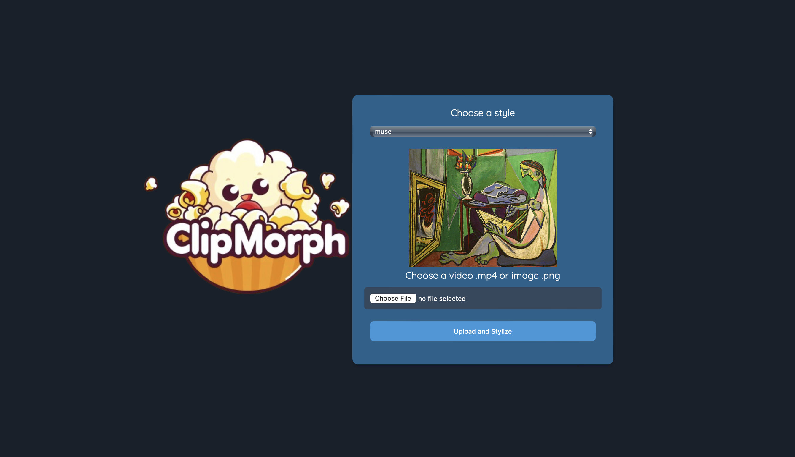

# Deployment

> [!WARNING]
> Due to the severe lack of GPU availability on Google Cloud Run, we could 
> sadly not deploy our model to GPU compute instances. We experimented with Vertex AI, but were 
> unable to make it work with our models, experiencing many issues with their 
> Predict API. Our model was tested locally on a GPU (both for training and inference) and works flawlessly, but we were 
> sadly limited to CPU-only deployment for the final project submission.

## Serving API

Our goal is for users to be able to remotely stylize a video or an image. 
The easiest way for this is to make a small web interface that serves the 
model, where a user can effortlessly upload a file and get the result back.

For this purpose, we chose [Flask](https://flask.palletsprojects.com/) as 
our web framework. All the code for the Flask app can be found in the
`app/` folder.

The app is a simple web interface with a small Python script that calls our 
package's API (see [`clipmorph/run.py`](clipmorph/run.py)) to stylize the 
image or video.

  
     
    
Example screenshot of the web application.

 

## Docker Container

> *Docker file:* [Dockerfile.app](Dockerfile.app)

We package our model serving API into a Docker container.

We include our codebase, a Python package, the Flask app code, as well as 
the pre-trained models (i.e., the different available styles) and 
associated style images. Afterwards, requirements are installed, including 
system packages like `ffmpeg`, then Python packages, like PyTorch. Finally, 
our own package `clipmorph` is installed, and the Flask app is started when 
the container is run.

This container can be run locally, or deployed to a cloud service like
Google Cloud Run, as described below.

## Cloud Deployment

> *App link:* [https://clipmorph.isach.be](https://clipmorph.isach.be)

As it was practically impossible to deploy a model on Google Cloud with a 
GPU, we opted for a CPU-only deployment, which sadly prevents from running 
on long videos fast. Note that the model runs in real time on a GPU.

We chose Google Cloud Run as our deployment platform. It is a serverless
platform that allows us to run our containerized application without having
to manage the underlying infrastructure. We parameterize a continuous 
deployment workflow from the console that triggers when a push is made to 
our master (or development) branch.

From the app, a user can upload a video or an image and obtain predictions 
remotely from one of our pre-trained models. Try it yourself! Use a short 
video please, e.g., 2 or 3 seconds max.

> [!NOTE]
> We were not able to implement the pipeline that allows users to upload 
> their styles that then start a model training automatically, as we are 
> unable to obtain a GPU online for training.
