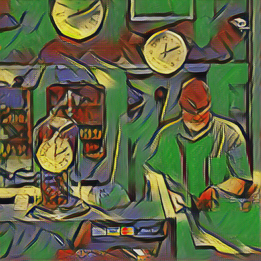

# Model Development

This page describes the development of our model, from choosing and 
collecting data, selecting the architecture, to training and evaluating the
model.

## Model Description

Our model is a so-called _"neural style transfer"_ model, i.e., a model 
based on deep learning that tries to replace the style of a video or an 
image by another style while keeping the content intact.

Our model is based on the pioneer work of Gatys et al. [^1], which 
introduced an optimization process for style transfer through the use of 
Gram matrices [^2] on the feature maps of a large pre-trained convolutional
neural network. This work was extended by Johnson et al. [^3] to avoid the 
per-image optimization process and to allow real-time style transfer. For 
this purpose, they train an image-to-image fully convolutional model that 
directly performs the entire optimization process in one forward pass. We 
complement this work by adding temporal consistency to the model, following 
the work of de Berker and Rainy [^4] that introduce a stabilization 
procedure through a specific addition of noise in the training process.

The resulting model is a U-Net-style [^5] architecture with 16 
convolutional layers (3 with down-sampling, 10 for processing, and 3 with
up-sampling). It is trained in a self-supervised manner to minimize 
_perceptual_ losses on the predicted image. These losses penalize 
differences in style with the target style and differences in content with
the input image being stylized. In addition, a _temporal_ loss penalizes 
unstable predictions of the model (i.e., small noise in input should lead 
to small differences in output), and a _total variation_ loss is used to
smooth the output and avoid high-frequency artifacts that are common in 
that field. 

One trained model encapsulates **_one_** given style and transforms 
input images so that their content stays intact while the style changes. A 
model can be trained in under 1 hour and perform inference 
in real-time (25-30FPS) on a single GPU. 

> [!NOTE]
> This project is based upon our previous project done in the "Deep Learning" 
> course two years earlier. More details about the original study of the 
> model can be found [here](https://github.com/iSach/video-nst). We have 
> in this new project improved the training loop and the architecture as well 
> as accelerated the inference process.

## Data Preparation

Training requires a large set of arbitrary images and one (or several) 
style reference images. We choose Visual Genome [^6] as our image bank 
(~65k samples), in opposition to Microsoft COCO [^7] used in the original paper, as we found 
it to provide better qualitative results, but any large similar dataset 
should work. The _perceptual_ losses are computed using feature maps of a deep
convolutional network. We use, as in [^1] and [^3], the VGG network [^8], 
although we opt for the VGG-19 variant instead of VGG-16.

Not much data preparation is needed, as only a diverse set of images is 
required. The code for loading data can be found [here](clipmorph/data/genome_loader.py).
A script for downloading the Visual Genome dataset can be found [here](clipmorph/training_data/download_genome.sh).

We perform no pre-processing on the images. They are simply resize to 
square images of a given size (e.g., 512x512) for performance trade-offs in 
training. They are also rescaled to have floating values between 0 and 1 
instead of the usual 0-255, in order to be fed to the network.

|    |  |
|------------------------------------------------|-----------------------------------------------|
|  |  |

**Figure:** First four images of the Visual Genome dataset.

We select a few well-known artworks as style images, as these images 
include very distinct and recognizable styles, and they are available in the 
public domain. Please find some in the `training_data/styles` folder.

## Training

Our model is implemented in PyTorch [^9] and trains on a single GPU in 
about one hour. The 
training code can be found [here](clipmorph/train.py). 

We use a batch size of 8 images, a learning rate of 1e-3, a style-to-content 
loss weight ratio of 1e5, a TV weight of 1e-6, and a temporal weight equal to 
1e3.

We train for 10,000 iterations on the Visual Genome dataset, approximately 
equal to one epoch. We use the Adam [^10] optimizer with default parameters.

Our hyperparameters were manually tweaked, and should ideally still be 
tuned for each given style, especially the style-to-content loss weight 
ratio as it influences the final result. Ultimately, the results are quite 
subjective and these are only parameters that ensure good model convergence no 
matter the style. We monitor the training process using Weights & Biases 
[^11] (see below).

## Evaluation

The task is itself already quite subjective, and the evaluation is 
therefore almost entirely qualitative. Quantitatively, we only check the 
convergence of the model for the different losses, especially content and 
style, to make sure that the model is learning something. 

We evaluate the model by tracking the evolution of the output images during 
training, as it represents the capacity of the model to stylize arbitrary 
images in the visual genome dataset, and no overfitting can be happen in 
only one epoch. Here are some examples of style images, arbitrary images and 
corresponding trained models.

| Style                                                       | Image                                                  | Stylized image                                        |
|-------------------------------------------------------------|--------------------------------------------------------|-------------------------------------------------------|
|         |         |       |
|  |  |     |
|    |    |  |
|       |       |     |

We also qualitatively validate our model on videos from the Kinetics-600 
dataset [^12]. Below, you can find an example of a stylized video, from the 
"Skiing mono" class of Kinetics-600.

|      |  |
|-----------------------------------------------------|---------------------------------------------------------------|
|  |  |

> [!IMPORTANT]
> As you can notice, the models are not as consistent as could be desired. 
> We were not able to get better results and preferred to focus on the 
> MLOps part of the project rather than further optimizing the model. 
> Better integration of gradient scaling, tuning the temporal loss weight as 
> well as related hyper-parameters (noise ratio and level) would be the first 
> paths to investigate.

## Weights & Biases

We monitor the training of our styles using Weights & Biases [^11]. We log 
the different loss components as well as qualitative examples being output 
to track the qualitative evolution of the model. We also log the model's 
parameters and gradients. You can see example monitoring below.

|         |  |
|-------------------------------------------------|---------------------------------------------|
|  |   |

### References
[^1]: Gatys, L. A., Ecker, A. S., & Bethge, M. (2016). Image style transfer using convolutional neural networks. In Proceedings of the IEEE conference on computer vision and pattern recognition (pp. 2414-2423).
[^2]: https://en.wikipedia.org/wiki/Gram_matrix
[^3]: Johnson, J., Alahi, A., & Fei-Fei, L. (2016). Perceptual losses for 
real-time style transfer and super-resolution. In Computer Vision–ECCV 2016: 14th European Conference, Amsterdam, The Netherlands, October 11-14, 2016, Proceedings, Part II 14 (pp. 694-711). Springer International Publishing.
[^4]: de Berker, A. and Rainy, J. (2018). [Stabilizing neural style-transfer 
for video](https://medium.com/element-ai-research-lab/stabilizing-neural-style-transfer-for-video-62675e203e42) on Medium.
[^5]: Ronneberger, O., Fischer, P., & Brox, T. (2015). U-net: Convolutional networks for biomedical image segmentation. In Medical image computing and computer-assisted intervention–MICCAI 2015: 18th international conference, Munich, Germany, October 5-9, 2015, proceedings, part III 18 (pp. 234-241). Springer International Publishing.
[^6]: Krishna, R., Zhu, Y., Groth, O., Johnson, J., Hata, K., Kravitz, J., ... & Fei-Fei, L. (2017). Visual genome: Connecting language and vision using crowdsourced dense image annotations. International journal of computer vision, 123, 32-73.
[^7]: Lin, T. Y., Maire, M., Belongie, S., Hays, J., Perona, P., Ramanan, D., ... & Zitnick, C. L. (2014). Microsoft coco: Common objects in context. In Computer Vision–ECCV 2014: 13th European Conference, Zurich, Switzerland, September 6-12, 2014, Proceedings, Part V 13 (pp. 740-755). Springer International Publishing.
[^8]: Simonyan, K., & Zisserman, A. (2014). Very deep convolutional networks for large-scale image recognition. arXiv preprint arXiv:1409.1556.
[^9]: Paszke, A., Gross, S., Massa, F., Lerer, A., Bradbury, J., Chanan, G., ... & Chintala, S. (2019). Pytorch: An imperative style, high-performance deep learning library. Advances in neural information processing systems, 32.
[^10]: Kingma, D. P., & Ba, J. (2014). Adam: A method for stochastic optimization. arXiv preprint arXiv:1412.6980.
[^11]: https://wandb.ai
[^12]: Carreira, J., Noland, E., Banki-Horvath, A., Hillier, C., & Zisserman, A. (2018). A short note about kinetics-600. arXiv preprint arXiv:1808.01340.
